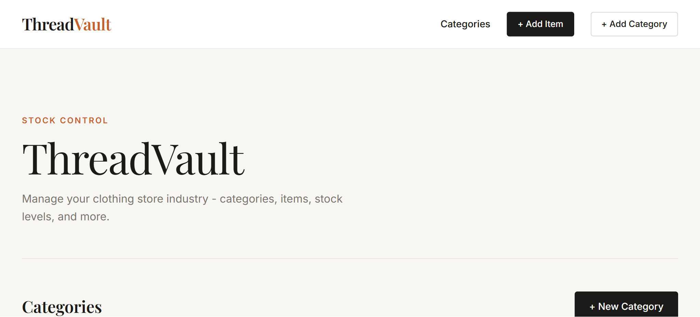
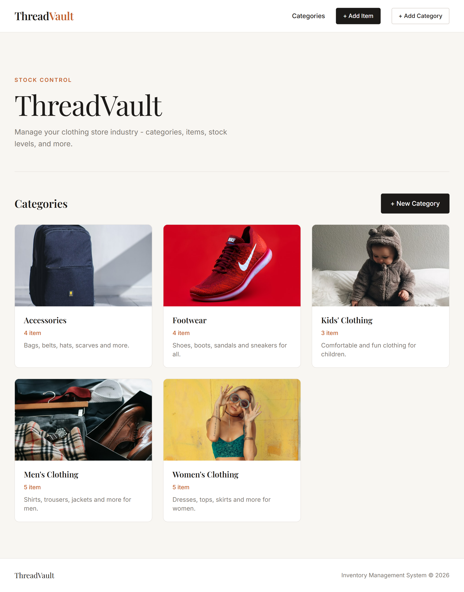
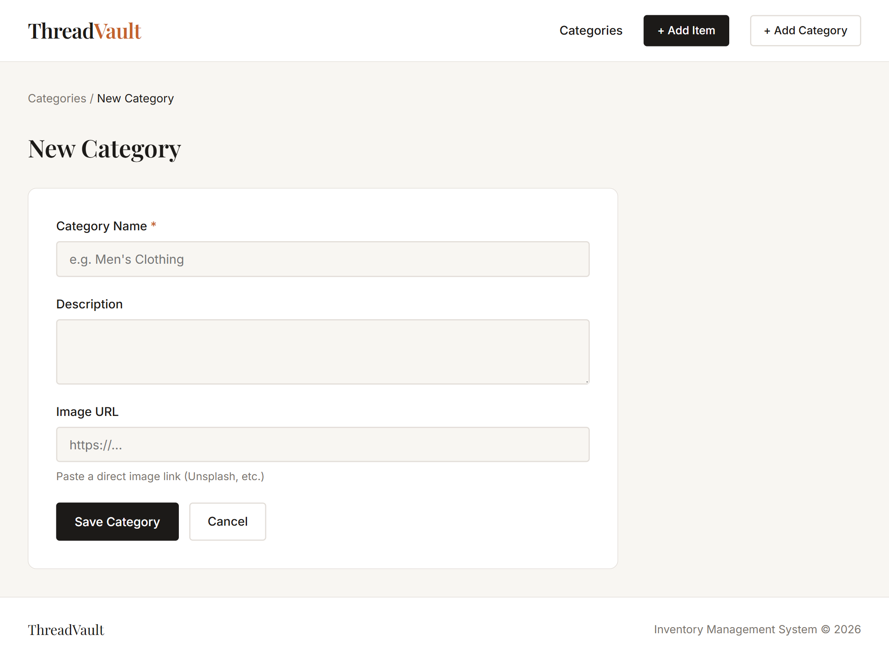
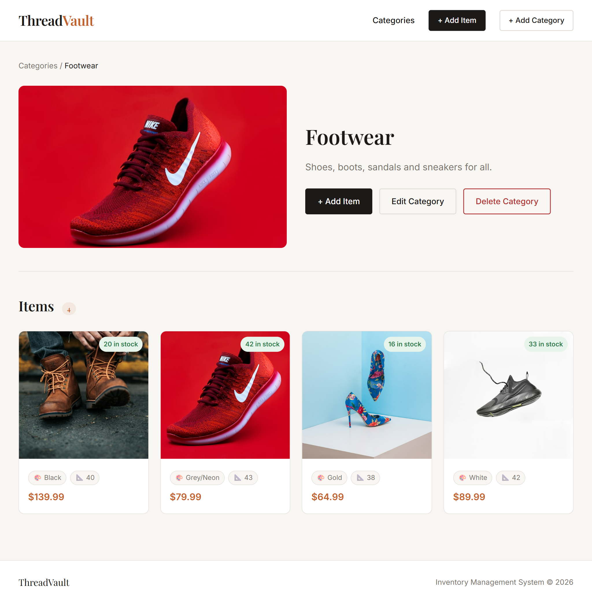
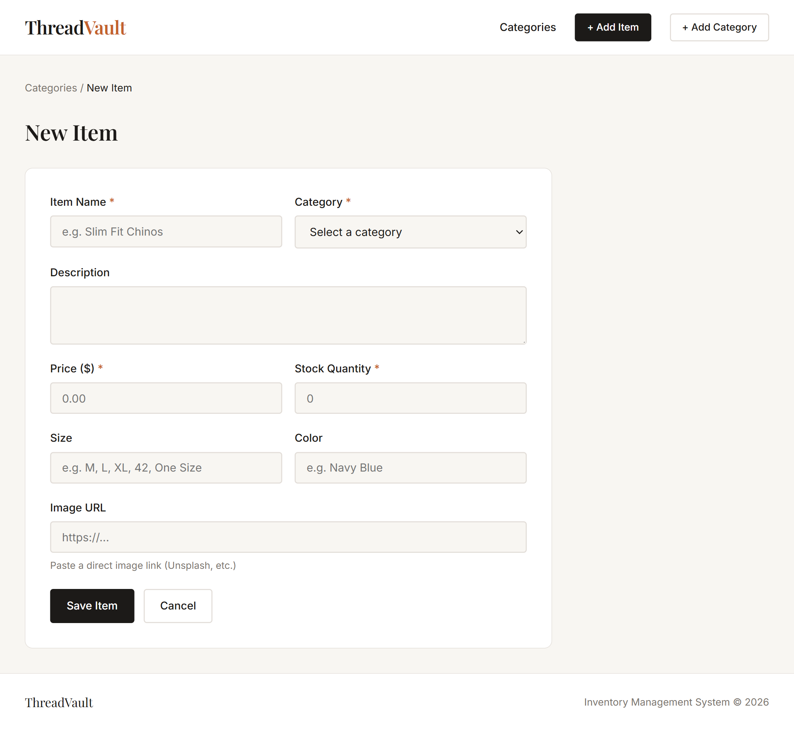
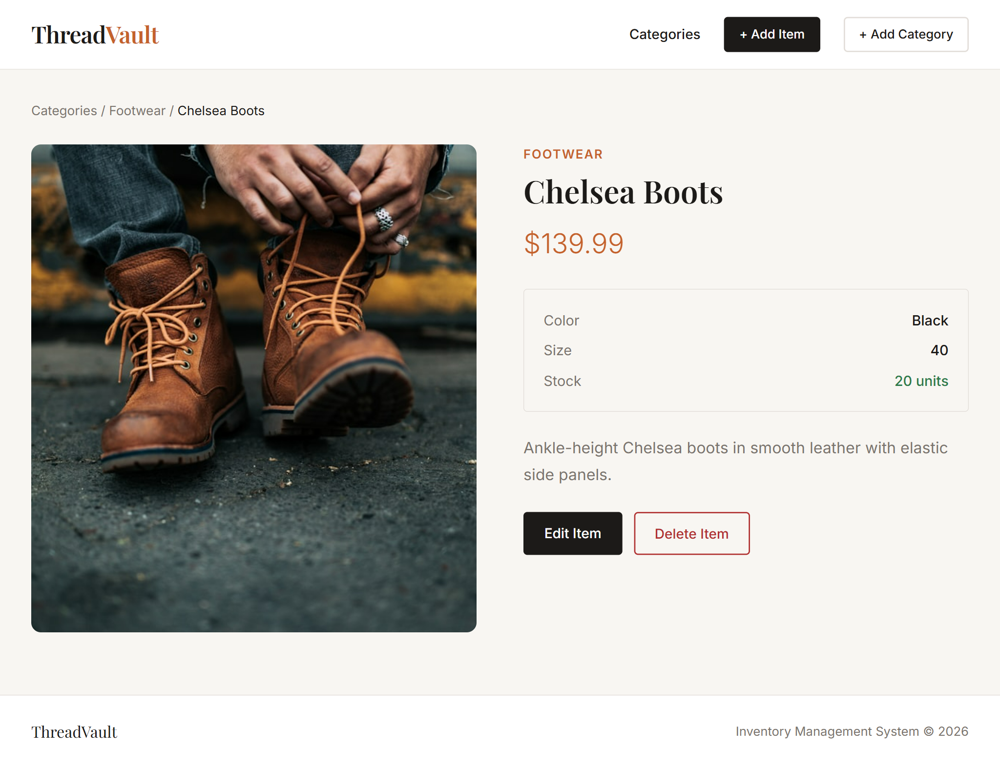
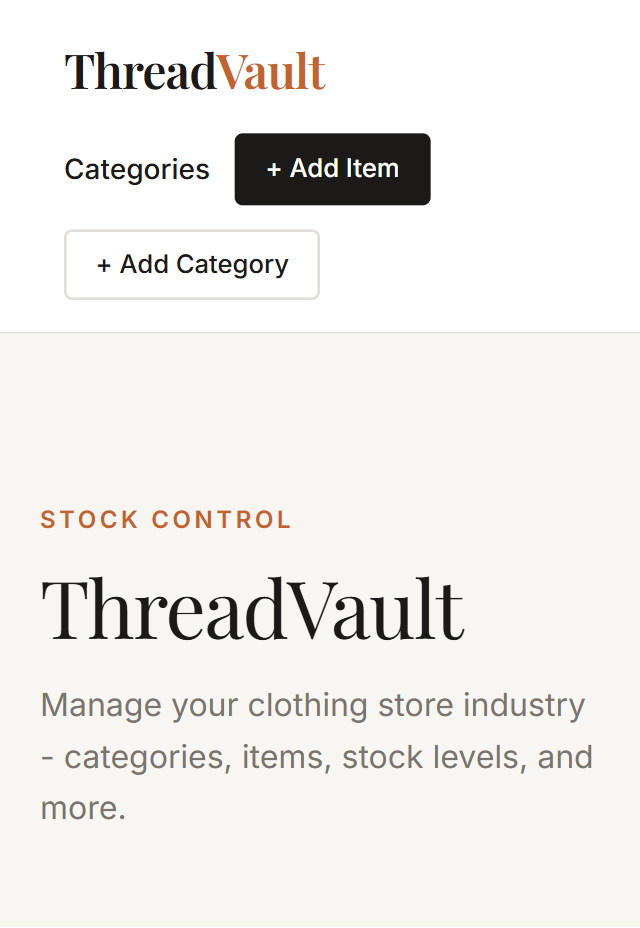
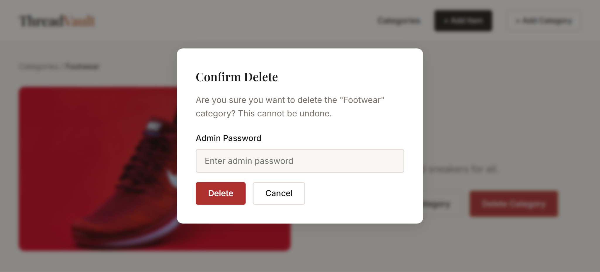
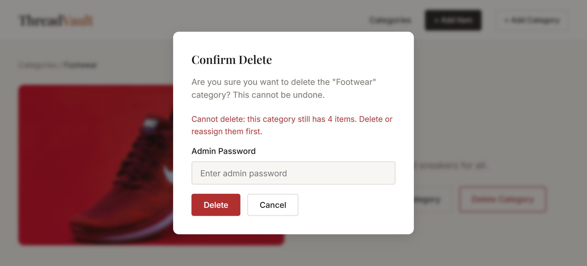

# ThreadVault — Clothing Store Inventory Manager

A full-stack inventory management app built with Express, EJS, and PostgreSQL.



[
[](https://github.com/Matthew1835/ThreadVault-inventory)

---

## Table of Contents

- [About](#about)
- [Pages](#pages)
- [Features](#features)
- [Tech Stack](#tech-stack)
- [Getting Started](#getting-started)
- [Deployment](#deployment)
- [Usage](#usage)
- [Screenshots](#screenshots)
- [What I Learned](#what-i-learned)
- [Project Structure](#project-structure)
- [Additional Features](#additional-features)
- [Contact](#contact)

---

## About

- This is an inventory management app for a clothing store
- This is one of the project assignments of The Odin Project

---

## Pages

- **Home** - Displays all categories
- **Add Category** - Form page to add new categories
- **Category Details** - Displays items in a category
- **Edit Category** - Form page to edit category
- **Add Item** - Form page to add new items
- **Item Details** - Displays detail information of an item
- **Edit Item** - Form page to edit item

---

## Features
- Browse clothing categories (Men's, Women's, Kids', Accessories, Footwear)
- Full CRUD for both categories and items
- Stock level indicators (OK / Low / Out of stock)
- Admin password protection for all delete/edit actions
- Responsive, editorial UI

---

## Tech Stack

- Node.js + Express
- PostgreSQL
- EJS
- CSS

---

## Getting Started

Follow these steps to run the project locally on your machine.

### Prerequisites

Make sure you have these installed:
- [Node.js](https://nodejs.org/) v18 or higher
- [npm](https://www.npmjs.com/) (comes with Node)
- [PostgreSQL](https://www.postgresql.org/) v14 or higher running locally
- A GitHub account (for deployment)

### Installation

1. Clone & install
   ```bash
   git clone <your-repo-url>
   cd clothing-inventory
   npm install
   ```

2. Create a PostgreSQL database
   ```bash
   createdb clothing_inventory
   ```

3. Configure environment
   ```bash
   cp .env.example .env
   ```
   Edit `.env`:
   ```
   DATABASE_URL=postgresql://localhost:5432/clothing_inventory
   ADMIN_PASSWORD=mysecretpassword
   PORT=3000
   ```

4. Create tables
   ```bash
   node db/init.js
   ```

5. Seed dummy data
   ```bash
   npm run seed
   ```

6. Start the server
   ```bash
   npm run dev   # development (nodemon)
   npm start     # production
   ```

Visit: http://localhost:3000

---

## Deployment 

### Railway

1. Push your project to GitHub.
2. Go to [railway.app](https://railway.app) → New Project → Deploy from GitHub repo.
3. Add a **PostgreSQL** plugin in Railway.
4. Set environment variables in Railway dashboard:
   - `DATABASE_URL` — auto-provided by Railway's Postgres plugin
   - `ADMIN_PASSWORD` — your chosen admin password
   - `NODE_ENV=production`
5. Railway auto-detects `npm start` from `package.json`.
6. After first deploy, run the seed script via Railway's CLI or shell:
   ```bash
   railway run node db/init.js
   railway run npm run seed
   ```

### Render

1. Push to GitHub.
2. New Web Service → connect repo.
3. Build command: `npm install`
4. Start command: `node app.js`
5. Add a **PostgreSQL** database in Render.
6. Set environment variables (`DATABASE_URL`, `ADMIN_PASSWORD`, `NODE_ENV=production`).
7. After deploy, open the Render Shell and run:
   ```bash
   node db/init.js
   npm run seed
   ```

---

## Usage

1. View all categories on the home page.
2. Add new categories and items by clicking the Add Category and Add Item buttons.
3. View the items in a category by clicking on a category card.
4. View an item's details by clicking on an item card.
5. Edit or delete categories and items as needed. 

---

## Screenshots

| Home | Add Category |
|------|--------------|
|  |  |

| Category Details | Add Item |
|------------------|----------|
|  |  |

| Item Details | Mobile View |
|--------------|-------------|
|  |  |

---

## Project Structure
```
clothing-inventory/
├── app.js              # Express entry point
├── db/
│   ├── pool.js         # PostgreSQL connection pool
│   ├── init.js         # Table creation script
│   ├── seed.js         # Dummy data seeder
│   ├── categoryDb.js   # Category queries
│   └── itemDb.js       # Item queries
├── controllers/
│   ├── categoryController.js
│   ├── itemController.js
│   └── validators.js
├── routes/
│   ├── categories.js
│   └── items.js
├── views/
│   ├── partials/       # header, footer, deleteModal
│   ├── categories/     # index, show, form
│   └── items/          # show, form
└── public/css/style.css
```

---

## Additional Features

### Admin Password
All destructive actions (delete category, delete item) require entering the `ADMIN_PASSWORD` set in your `.env`. This is checked server-side on every destructive POST request.



### Delete Behaviour
- **Deleting a category with items** → blocked with an error message. You must delete or reassign all items in the category first.
- **Deleting an item** → permanently removes the item and redirects to its parent category.



---

## What I Learned

- Structuring a full-stack MVC app from scratch
- Working with PostgreSQL using raw SQL
- Relational data and foreign key constraints
- Reusing EJS templates
- Environment variable and deploying config
- Basic security without a full auth system

---

## Contact

**Myat Thuta (Matthew)**
- Portfolio: *https://matthew1835.github.io/my-portfolio/*
- LinkedIn: *https://www.linkedin.com/in/myat-thuta-26051a273/*
- Email: *myatthuta1835@gmail.com*
- GitHub: [@Matthew1835](https://github.com/Matthew1835)

---

## License

This project is open source and available under the [MIT License](LICENSE).

---

*⭐ If you found this project interesting, feel free to star the repo!*
